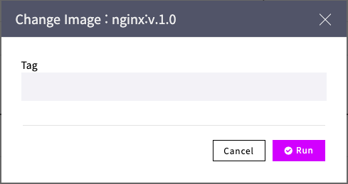

# CI/CD 파이프라인 구성

애플리케이션의 빌드에서 배포, 운영 까지의 “개발/운영\(DevOps\)의 연속성”은 기업 IT 서비스 생산성과 요구 대응 민첩성 측면에서 중요합니다.

칵테일 클라우드가 제공하는 애플리케이션 빌드/배포 파이프라인 자동화 기능은 자체적으로 개발한 기술로서 DevOps 파이프라인의 높은 성능과 자동화를 제공합니다.

## 어떤 기능을 제공하는가?

사용자는 이미지 빌드 과정을 구성하는 코드 다운로드, 코드 빌드, 테스트 등의 개별 작업 단계를 정의하여 연결함으로써 빌드 파이프라인을 구성하고 실행할 수 있습니다.

## CI/CD 파이프라인의 특장점은 무엇인가요?

### 유연한 빌드 파이프라인 구성

각각의 이미지 빌드 단계를 사용자가 정의할 수 있기 때문에, 빌드 과정을 유연하게 구성할 수 있습니다.

### 빌드 파이프라인 자동화

파이프라인이 구성되면 코드로부터 컨테이너 빌드까지의 전과정이 자동적으로 수행됩니다.

### 가볍고, 빠른 실행

Jenkins 같은 오픈 소스 도구에 비해 더욱 가볍고 빠르게 실행됩니다.

## 태스크 목록

* 이미지 빌드 파이프라인 생성
* 이미지 빌드 실행
* 파이프라인 목록 조회
* 파이프라인 메뉴에서의 이미지 업데이트 및 빌드 수행

## 1. 이미지 빌드 파이프라인 생성

워크 그룹 화면에서 좌측 이미지/빌드 메뉴를 선택하면, 사용자가 설정해 놓은 이미지 빌드 목록이 표시됩니다. 우측 상단의 "+생성" 버튼을 클릭합니다.

### 1.1 빌드 기본 정보 입력

이미지 명, 생성할 이미지 결과를 업로드할 레지스트리, 이미지 태그를 입력합니다.

![\[&#xD654;&#xBA74;\] &#xBE4C;&#xB4DC; &#xAE30;&#xBCF8; &#xC815;&#xBCF4; &#xC785;&#xB825;](../.gitbook/assets/2020-10-15-2.05.10.png)

### 1.2 파이프라인의 단위 빌드 작업 입력

이미지 파이프라인은 한개 이상의 단위 빌드 작업들로 구성됩니다. 각각의 단위 빌드 작업들에 대해 빌드 작업을 추가하고, 작업에 대한 설정을 수행하도록 합니다. 

지원하는 빌드 작업 유형은 다음과 같습니다.

* 코드 리파지토리 작업
* 사용자 작업
* 파일\(FTP\) 작업
* REST 호출 작업
* 스크립트 작업
* 이미지 빌드 작

빌드 작업 섹션 오른 편의 "+" 버튼을 클릭하여 빌드 작업을 추가하도록 합니다.

![\[&#xD654;&#xBA74;\] &#xBE4C;&#xB4DC; &#xC791;&#xC5C5; &#xC720;&#xD615; &#xC120;&#xD0DD;](../.gitbook/assets/2020-10-15-2.05.40.png)

#### 1.2.1 코드 리파지토리 작업 설정

소스 코드가 존재하는 리파지토리와 브랜치 정보를 입력하고, 소스 코드를 접근하기 위한 사용자 정보를 입력합니다. 해당 위치에 존재하는 소스 코드를 사용자가 설정한 코드 저장 경로에 저장하거나 GIT 프로젝트 이름 경로\(코드 저장 경로를 설정하지 않았을 경우\)에 저장합니다.

![\[&#xD654;&#xBA74;\] &#xCF54;&#xB4DC; &#xB9AC;&#xD30C;&#xC9C0;&#xD1A0;&#xB9AC; &#xC791;&#xC5C5;](../.gitbook/assets/2020-10-15-2.07.16.png)

#### 1.2.2 사용자 작업 설정

컨테이너를 기반으로 실행할 사용자 작업을 설정합니다. 작업 볼륨의 설정을 통해 작업의 입력을 받아 들이거나 수행 결과를 남기는 것이 가능합니다.

![\[&#xD654;&#xBA74;\] &#xC0AC;&#xC6A9;&#xC790; &#xC791;&#xC5C5; &#xC124;&#xC815;](../.gitbook/assets/2020-10-15-2.14.34.png)

#### 1.2.3 파일\(FTP\) 작업

빌드할 대상 관련 리소스를 포함하는 원격 호스트와 빌드 작업을 수행할 빌드 호스트 사이에 파일이나 디렉토리를 다운로드하거나 업로드 하는 작업을 설정합니다.

![\[&#xD654;&#xBA74;\] &#xD30C;&#xC77C;\(FTP\) &#xC124;&#xC815;](../.gitbook/assets/2020-10-15-2.23.02.png)

#### 1.2.4 REST 호출 작업

외부 서비스와 REST 방식으로 연동이 필요한 경우, REST 호출 작업을 설정합니다.

![\[&#xD654;&#xBA74;\] REST &#xD638;&#xCD9C; &#xC124;&#xC815;](../.gitbook/assets/2020-10-15-2.25.07.png)

#### 1.2.5 스크립트 작업

스크립트 작업을 정의합니다.

![\[&#xD654;&#xBA74;\] &#xC2A4;&#xD06C;&#xB9BD;&#xD2B8; &#xC791;&#xC5C5; &#xC124;&#xC815;](../.gitbook/assets/2020-10-15-2.32.02.png)

#### 1.2.6 이미지 빌드 작업

도커 파일 내용을 직접 입력하거나 도커 파일 경로를 입력합니다.

![\[&#xD654;&#xBA74;\] &#xB3C4;&#xCEE4; &#xD30C;&#xC77C; &#xC791;&#xC5C5; &#xC785;&#xB825;](../.gitbook/assets/2020-10-15-2.33.11.png)

## 2. 이미지 빌드 실행

### 2.1 이미지 빌드  조회

워크 그룹 화면에서 좌측 이미지/빌드 메뉴를 선택하면, 사용자가 설정해 놓은 이미지 빌드 목록이 표시됩니다. 조회를 원하는 이미지 명을 클릭합니다.

### 2.2 빌드 실행

빌드를 실행할 이미지 태그를 선택한 후, 빌드 실행 컬럼 아래의 삼각형 버튼을 클릭합니다. 빌드 노트 입력 창이 나타나면 빌드 작업에 대한 설명을 입력합니다.

![\[&#xD654;&#xBA74;\] &#xBE4C;&#xB4DC; &#xC0C1;&#xC138; &#xD654;&#xBA74;&#xC5D0;&#xC11C; &#xBE4C;&#xB4DC; &#xC2E4;&#xD589;](../.gitbook/assets/2020-10-15-2.49.25.png)

### 2.3 빌드 진행 상황 조회

이미지 빌드 파이프라인 작업이 진행되면서 개별 빌드 작업의 진행 상황을 조회합니다. 처음에는 모두 Wait 상태였다가 성공적으로 종료되었을 경우에는 모두 Done 상태로 표시됩니다.

![\[&#xD654;&#xBA74;\] &#xBE4C;&#xB4DC; &#xC9C4;&#xD589; &#xC0C1;&#xD669; &#xC870;&#xD68C;](../.gitbook/assets/2020-10-15-2.51.00.png)

### 2.4 빌드 내역 조회

빌드 상세 화면에서 우측 상단의 "빌드 내역" 버튼을 클릭합니다. 빌드 수행 이력이 표시됩니다.

![\[&#xD654;&#xBA74;\] &#xBE4C;&#xB4DC; &#xC9C4;&#xD589; &#xC0C1;&#xD669; &#xC870;&#xD68C;](../.gitbook/assets/2020-10-15-2.53.15.png)

특정 빌드 수행 건에 대한 빌드 로그를 조회하기 위해서는 해당 빌드 건에 대해 "빌드 로그" 아이콘을 클릭합니다. 빌드가 실패하여 상태가 Error로 표시된 경우에는 빌드 로그를 조회함으로써 실패 이유를 확인할 수 있습니다.

![\[&#xD654;&#xBA74;\] &#xBE4C;&#xB4DC; &#xB0B4;&#xC5ED; &#xC870;&#xD68C;](../.gitbook/assets/2020-10-15-2.54.48.png)

## 3. 파이프라인 목록 조회

특정 서비스 맵의 상단 파이프라인 메뉴를 조회하면 해당 서비스 맵에 속하는 대상 컨테이너들의 이미지 정보 및 빌드 정보를 조회할 수 있습니다.

대상 컨테이너의 업데이트 유형은 빌드 유형과 이미지 유형으로 구분됩니다. 빌드 유형의 경우 컨테이너 이미지는 칵테일 클라우드에서 구성한 CI/CD 파이프라인을 통해 빌드됩니다. 이미지 유형의 경우 컨테이너 이미지는 외부에서 이미 생성된 이미지를 사용만 하는 경우입니다.

![\[&#xD654;&#xBA74;\] &#xD30C;&#xC774;&#xD504;&#xB77C;&#xC778; &#xBAA9;&#xB85D; &#xC870;&#xD68C;](../.gitbook/assets/2020-10-15-2.58.45.png)

## 4. 파이프라인 메뉴에서의 이미지 업데이트 및 빌드 수행

### 4.1 이미지 업데이트 

파이프라인 목록 조회 화면에서 이미지를 업데이트하고자 하는 대상 컨테이너의 우측 업데이트 컬럼 아래의 좌우 화살표를 클릭하면 이미지 변경이 가능합니다. 

![\[&#xD654;&#xBA74;\] &#xB300;&#xC0C1; &#xCEE8;&#xD14C;&#xC774;&#xB108; &#xC774;&#xBBF8;&#xC9C0; &#xBCC0;&#xACBD; &#xC2E4;&#xD589;](../.gitbook/assets/2020-10-15-3.09.22.png)

이미지 변경을 선택하였을 때, 새로운 이미지 태그 정보를 입력하거나 기존에 빌드되었던 이미지 태그 목록 중에서 선택할 수 있는 팝업이 표시됩니다.

![\[&#xD654;&#xBA74;\] &#xC774;&#xBBF8;&#xC9C0; &#xD0DC;&#xADF8; &#xBCC0;&#xACBD; &#xC218;&#xD589; \(&#xAE30;&#xC874; &#xBE4C;&#xB4DC;&#xD588;&#xB358; &#xC774;&#xBBF8;&#xC9C0; &#xD0DC;&#xADF8;&#xB4E4; &#xC911;&#xC5D0;&#xC11C; &#xC120;&#xD0DD;&#xD558;&#xB294; &#xACBD;&#xC6B0;\)](../.gitbook/assets/2020-10-15-3.08.35.png)

### 4.2 빌드 수행

파이프라인 목록 조회 화면에서 빌드를 수행하고자 하는 대상 컨테이너의 우측 업데이트 컬럼 아래의 삼각형을 클릭하면 빌드 수행이 가능합니다. 

![\[&#xD654;&#xBA74;\] &#xBE4C;&#xB4DC; &#xC218;&#xD589; &#xC2E4;&#xD589;](../.gitbook/assets/2020-10-15-3.16.04.png)

빌드 수행을 선택하면 빌드 노트 \(빌드 수행에 대한 설명\)를 입력합니다. 빌드 수행으로 인한 업데이트 상태를 조회할 수 있습니다.  

![\[&#xD654;&#xBA74;\] &#xBE4C;&#xB4DC; &#xC218;&#xD589; &#xD6C4; &#xCEE8;&#xD14C;&#xC774;&#xB108; &#xC5C5;&#xB370;&#xC774;&#xD2B8; &#xC0C1;&#xD0DC; &#xC870;&#xD68C;](../.gitbook/assets/2020-10-15-3.17.20.png)

