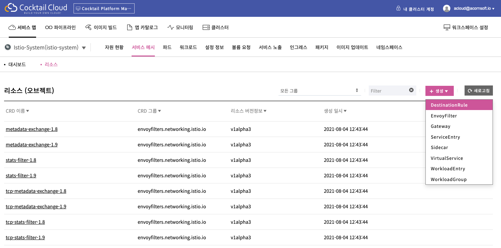

# 서비스 메시 구성

서비스 시는 애플리케이션들과 그들 사이의 인터랙션을 구성하는 마이크로서비스들의 네트워크를 기술하기 위해 사용되는 개념입니다.

서비스 시를 관리하기 위한 시장 표준 기술이 Istio입니다. 칵테일은 Istio의 설치와 모니터링을 지원합니다.

## 어떤 정보를 제공하는가?

* 서비스 간 연결 구성을 가시화하여 제공합니다.
* 네트워크 트래픽 모니터링 정보를 제공합니다.

## 서비스 메시 구성의 특장점은 무엇인가요?

### Istio 설치의 용이성

칵테일 클라우드의 애드온 기능을 통해 손쉽게 Istio의 설치가 가능합니다. 

### 칵테일 클라우드와 Istio 모니터링 화면의 통합

Istio의 모니터링 화면이 칵테일 클라우드의 웹 UI와 통합되어 제공됩니다.

## 태스트 목록

* 서비스 메시 설치
* 서비스 메시 조회

## 1. 서비스 메시 설치

서비스 메시를 이용하기 위해서는 플랫폼 관리자가 특정 클러스터에 애드온 기능을 통해 Istio를 배포해야 합니다.

### 1.1 클러스터 목록 조회

플랫폼 관리 화면에서 좌측 클러스터 메뉴를 선택합니다.

![\[&#xD654;&#xBA74;\] &#xD074;&#xB7EC;&#xC2A4;&#xD130;&#xC5D0; &#xC124;&#xCE58;&#xB41C; &#xC560;&#xB4DC;&#xC628; &#xBAA9;&#xB85D; &#xC870;&#xD68C;](../.gitbook/assets/2020-10-15-4.08.58.png)

### 1.2 클러스터에 설치된 애드온 목 조회

클러스터 목록에서 Istio 설치를 원하는 클러스터 이름을 클릭하면, 해당 클러스터에 대한 개요 조회 화면이 표시됩니다. 이때 상단의 "애드온" 메뉴를 클릭하면, 해당 클러스터에 설치된 애드온의 목록이 표시됩니다.

![\[&#xD654;&#xBA74;\] &#xC560;&#xB4DC;&#xC628; &#xBAA9;&#xB85D; &#xC870;&#xD68C;](../.gitbook/assets/2020-10-15-4.19.54.png)

### 1.3 클러스터에 설치 가능한 애드온 목록 조회

Istio를 설치하기 위해서는 애드온 목록 조회 화면의 우측 상단 "배포" 버튼을 클릭합니다. 이미 클러스터에 설치된 애드온과 설치가능한 애드온 목록이 표시됩니다.

![\[&#xD654;&#xBA74;\] &#xC560;&#xB4DC;&#xC628; &#xBAA9;&#xB85D; &#xC870;&#xD68C;](../.gitbook/assets/2020-10-15-4.20.38.png)

### 1.4 Istio 애드온 정보 조회 

Istio 카드의 "배포" 버튼을 클릭합니다. Istio 애드온에 대한 설명과 배포 시 설정 가능한 Parameter에 대한 설명이 표시됩니다. 

![\[&#xD654;&#xBA74;\] Istio &#xC560;&#xB4DC;&#xC628; &#xC815;&#xBCF4; &#xC870;&#xD68C;](../.gitbook/assets/2020-10-15-4.23.22.png)

### 1.5 Istio 배포

Istio 애드온 정보 조회 화면의 상단 우측 "설정" 버튼을 클릭하면, Istio 배포를 위한 설정 정보 입력 화면이 나타납니다. 설정 정보를 입력한 후 "배포" 버튼을 클릭합니다.

![\[&#xD654;&#xBA74;\] Istio &#xBC30;&#xD3EC;&#xB97C; &#xC704;&#xD55C; &#xC124;&#xC815; &#xC815;&#xBCF4; &#xC785;&#xB825;](../.gitbook/assets/2020-10-15-4.25.07.png)

클러스터에 istio가 설치되고 나면 해당 클러스터에 속한 서비스 맵 화면을 접근했을 때, 상단에 "서비스 메시" 메뉴가 노출됩니다.

## 2. 서비스 메시 조회

특정 서비스 맵에 대해서 "서비스 메시" 메뉴를 접근합니다. 화면 중앙에 서비스와 워크로드 사이의 연결 관계 및 요청/응답 관련 정보가 표시됩니다. 화면 우측에는 화면 중앙에서 선택한 연결 관계 상의 트래픽 관련 정보가 표시됩니다.

![\[&#xD654;&#xBA74;\] &#xC11C;&#xBE44;&#xC2A4; &#xBA54;&#xC2DC; &#xBAA8;&#xB2C8;&#xD130;&#xB9C1;](../.gitbook/assets/2020-10-15-4.54.39.png)

### 2.1 그래프 조회 방법 안내

화면 상단 Graph 오른쪽 물음표 버튼을 클릭하면 그래프 조회 방법을 안내받을 수 있습니다.

![\[&#xD654;&#xBA74;\] &#xADF8;&#xB798;&#xD504; &#xC870;&#xD68C; &#xBC29;&#xBC95;](../.gitbook/assets/2020-10-15-4.55.01.png)

### 2.2 그래프 유형 선택

조회하고자 하는 그래프 유형을 선택합니다.

![\[&#xD654;&#xBA74;\] &#xADF8;&#xB798;&#xD504; &#xC720;&#xD615; &#xC120;&#xD0DD;](../.gitbook/assets/2020-10-15-4.57.38.png)

제공되는 그래프 유형은 다음과 같습니다.

* App Graph: 서비스와 워크로드 사이의 연결 관계를 표시합니다. 이 때, 워크로드의 모든 버전을 하나의 그래프 노드로 표시합니다.
* Service Graph: 서비스 사이의 연결 관계를 표시합니다.
* Versioned App Graph: 서비스와 워크로드 사이의 연결 관계를 표시합니다. 이때, 워크로드의 버전이 여러 개 존재할 때, 워크로드의 개별 버전과의 연결 관계까지 표시합니다. 또한, 동일한 워크로드의 여러 버전을 하나의 박스 안에 포함시켜 표시합니다.
* Workload Graph: 서비스와 워크로드 사이의 연결 관계를 표시합니다. 이때, 워크로드의 버전이 여러 개 존재할 때, 워크로드의 개별 버전과의 연결 관계까지 표시합니다. Versioned App Graph와는 달리, 동일한 워크로드의 여러 버전을 하나의 박스 안에 포함시켜 표시하지는 않습니다.

### 2.3 그래프 표시 정보 설정

그래프 상에서 노드를 연결하는 Edge 상에서 표시되는 정보를 설정할 수 있습니다. 또한, 그래프 상에서 표시되는 요소들을 설정할 수 있습니다.

![\[&#xD654;&#xBA74;\] Edge &#xC0C1;&#xC758; &#xD45C;&#xC2DC; &#xC815;&#xBCF4; &#xC120;&#xD0DD;](../.gitbook/assets/2020-10-15-4.57.49.png)

![\[&#xD654;&#xBA74;\] &#xADF8;&#xB798;&#xD504; &#xC0C1;&#xC5D0;&#xC11C; &#xD45C;&#xC2DC;&#xD560; &#xC694;&#xC18C; &#xC120;&#xD0DD;](../.gitbook/assets/2020-10-15-4.58.00.png)

## 3. 서비스 메시 설정

"서비스 메시" 메뉴에 접근 시 기본적으로 "대시보드" 메뉴에 접근하게 되며 위의 2. 서비스 메시 조회 에서 설명한대로 서비스와 워크로드 사이의 연결 관계 및 요청 / 응답 관련 정보등을 확인할 수 있었습니다.

"서비스 메시" 메뉴에는 "리소스" 라는 서브메뉴가 존재하는데 해당 메뉴에서 Istio의 Traffic을 관리할 수 있는 기능을 제공합니다.

### 3.1 주요 설정 정보

"서비스 메시" - "리소스" 메뉴에서는 서비스 메시의 주요 기능중 Traffic Management 관련 설정이 가능합니다.


#### [https://istio.io/latest/docs/concepts/traffic-management/](https://istio.io/latest/docs/concepts/traffic-management/)


Traffic Management를 구성하는 Object는 Kubernetes의 Custom Resource Definition \(CRD\)를 이용하여 정의할 수 있습니다.

"리소스" 메뉴에서는 이러한 CRD를 생성 / 편집할 수 있도록 기능을 제공하여 Istio의 Traffic Management 설정이 가능하도록 합니다.

### 3.2 리소스 유형

* DestinationRule
  * [https://istio.io/latest/docs/reference/config/networking/destination-rule](https://istio.io/latest/docs/reference/config/networking/destination-rule)
* EnvoyFilter
  * [https://istio.io/latest/docs/reference/config/networking/envoy-filter](https://istio.io/latest/docs/reference/config/networking/envoy-filter)
* Gateway
  * [https://istio.io/latest/docs/reference/config/networking/gateway](https://istio.io/latest/docs/reference/config/networking/gateway)
* ServiceEntry
  * [https://istio.io/latest/docs/reference/config/networking/service-entry](https://istio.io/latest/docs/reference/config/networking/service-entry)
* Sidecar
  * [https://istio.io/latest/docs/reference/config/networking/sidecar](https://istio.io/latest/docs/reference/config/networking/sidecar)
* VirtualService
  * [https://istio.io/latest/docs/reference/config/networking/virtual-service](https://istio.io/latest/docs/reference/config/networking/virtual-service)
* WorkloadEntry
  * [https://istio.io/latest/docs/reference/config/networking/workload-entry](https://istio.io/latest/docs/reference/config/networking/workload-entry)
* WorkloadGroup
  * [https://istio.io/latest/docs/reference/config/networking/workload-group](https://istio.io/latest/docs/reference/config/networking/workload-group)

### 3.3 리소스 구성

"리소스" 메뉴에서 "생성" 버튼을 클릭한 후 각각의 리소스 유형에 맞는 설정을 할 수 있습니다.

리소스의 구성은 YAML 편집기를 이용하여 생성 / 편집이 가능하며, 이미 생성되어 있는 구성 정보에 대한 삭제 기능도 제공됩니다.

